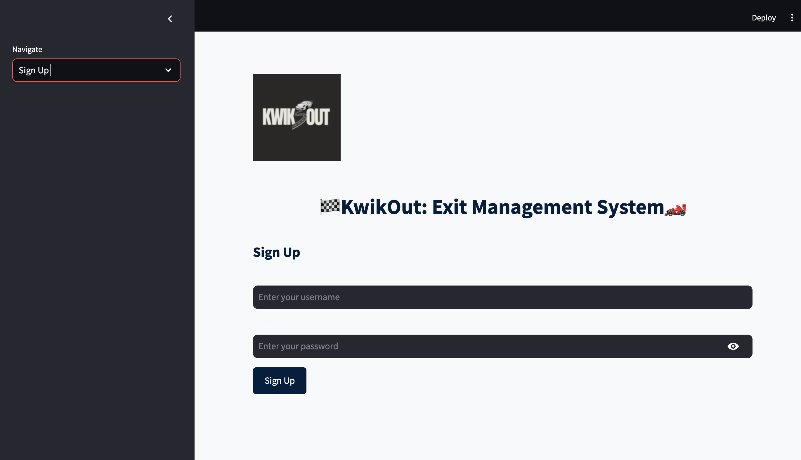
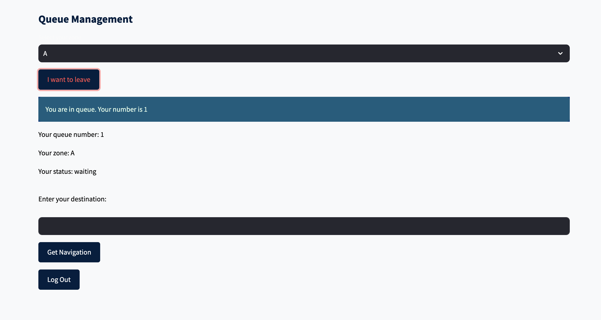
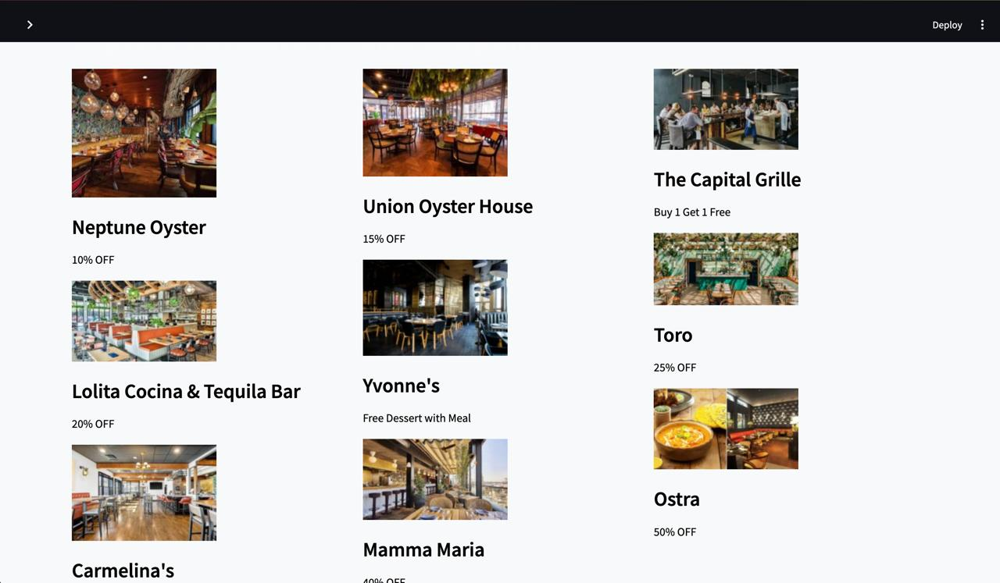

# KwikOut 🚗


Welcome to **KwikOut**, an exit management system designed to streamline the process of leaving large events like concerts, sports venues, or any gathering where people exit en masse. KwikOut ensures an organized and efficient exit by assigning queue numbers to users, minimizing chaos, and providing navigation assistance to your destination.

## Features

- **User Authentication**: Secure login and signup system using MySQL.
- **Queue Management**: Real-time queue management that auto-decrements queue numbers, ensuring an orderly exit process.
- **Google Maps Integration**: Once it's your turn to leave, KwikOut provides you with a navigation link to your destination using Google Maps.
- **Explore Page**: Explore nearby restaurants and exclusive discount coupons before heading home.

## How It Works

1. **Sign Up / Log In**: Users can create an account or log in to their existing account.
2. **Request to Leave**: Users can select their zone and request to leave, getting a queue number assigned to them.
3. **Real-Time Updates**: Queue numbers auto-decrement in real time, notifying users when it's their turn to leave.
4. **Destination Input**: After your queue number reaches 1, input your destination and receive a Google Maps navigation link.
5. **Explore Nearby Restaurants**: Before heading out, check out nearby restaurants and discounts on the Explore page.

## Technologies Used

- **Python**: Main programming language.
- **Streamlit**: Frontend framework for creating the interactive web application.
- **MySQL**: Relational database for storing user information and queue data.
- **Google Maps API**: Integration for generating navigation links to your desired destination.
- **dotenv**: Securely load environment variables from a `.env` file.

## Installation

### Prerequisites

- **Python 3.x**
- **MySQL**: Installed and configured.
- **Google Maps API Key**: You will need a Google Maps API key for navigation functionality.

### Step-by-Step Guide

1. **Clone the repository**:

   ```bash
   git clone https://github.com/yourusername/kwikout.git
   cd kwikout
   ```

2. **Install dependencies**:

   ```bash
   pip install -r requirements.txt
   ```

3. **Configure Environment Variables**:

   Create a `.env` file in the project root and add your MySQL database credentials and Google Maps API key:

   ```bash
   DB_HOST=your_database_host
   DB_USER=your_database_user
   DB_PASSWORD=your_database_password
   DB_NAME=your_database_name
   GOOGLE_MAPS_API_KEY=your_google_maps_api_key
   ```

4. **Set Up MySQL Database**:

   Open MySQL and run the following commands to set up the database and tables:

   ```sql
   CREATE DATABASE exit_management;
   USE exit_management;

   CREATE TABLE users (
       id INT AUTO_INCREMENT PRIMARY KEY,
       username VARCHAR(100) NOT NULL,
       password VARCHAR(100) NOT NULL
   );

   CREATE TABLE exit_queue (
       id INT AUTO_INCREMENT PRIMARY KEY,
       user_id INT,
       queue_number INT,
       zone VARCHAR(10),
       status ENUM('waiting', 'exited') DEFAULT 'waiting',
       FOREIGN KEY (user_id) REFERENCES users(id)
   );
   ```

5. **Run the Application**:

   Launch the Streamlit application:

   ```bash
   streamlit run app.py
   ```

6. **Access the Application**:

   Open your web browser and navigate to `http://localhost:8501` to start using KwikOut.

## Usage

- **Login/Sign Up**: Start by logging in or signing up.
- **Queue Management**: Request to leave, wait for your turn, and input your destination when it's time to go.
- **Explore Nearby Restaurants**: Browse nearby restaurants with special offers before heading home.

## Screenshots

### Home Page


### Queue Management


### Explore Page


## Contributing

We welcome contributions to KwikOut! If you'd like to contribute, please fork the repository, make your changes, and submit a pull request.

## License

This project is licensed under the MIT License - see the [LICENSE](LICENSE) file for details.

## Contact

- **Project Maintainer**: Amitesh Tripathi, Aaquib Awais Shaikh, Hari Sai Kumar Gavara
- **Email**: 1amiteshtripathi@gmail.com, aaquibs.0100@gmail.com, ghssaikumar09@gmail.com
- **GitHub**: [theamiteshtripathi](https://github.com/theamiteshtripathi)

